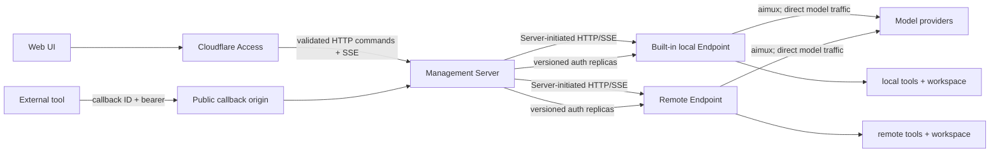

# zode system architecture

Status: authoritative system boundary. `docs/design.md` defines the Endpoint
runtime, `docs/http-api.md` defines the Endpoint protocol,
`docs/server-api.md` defines the management Server and UI-facing protocol, and
`docs/auth-replication.md` defines credential distribution. `docs/access.md`
defines Cloudflare Access ingress and actor isolation.

## 1. Product shape

zode is one product composed from two independently usable services and one
web client:

- **Endpoint** executes durable agent sessions on one device. It owns the
  runtime, local tools and workspace access, local provider execution through
  aimux, append-only session events, snapshots, and an encrypted credential
  replica store.
- **Server** is the management control plane. It validates Cloudflare Access
  assertions, owns endpoint inventory, provider login and auth-profile
  authority, credential distribution, a stateless Endpoint proxy, and the API
  consumed by the web UI. It has no user system and does not own or persist
  sessions.
- **Web UI** talks only to Server. It never connects directly to an Endpoint or
  a provider.

The primary product goal is configure provider credentials or complete a
provider login once on Server, select the desired devices, and use agents
running on those devices without configuring every Endpoint separately.



## 2. Non-negotiable boundaries

### Endpoint is passive with respect to Server

Endpoint exposes an authenticated, versioned HTTP command/query API and SSE
event streams. Server initiates every connection to Endpoint.

Endpoint must not:

- register itself with Server;
- maintain a reverse WebSocket, heartbeat, or reconnect loop to Server;
- depend on Server user, tenant, UI, routing, or database types;
- discover Server through ambient configuration;
- send session events to Server on its own.

Endpoint may make outbound requests only as part of execution, such as direct
provider requests through aimux or configured tool adapters. Device discovery,
addressing, tunnels, relays, VPNs, and reverse connectivity are external
infrastructure or Server concerns, not Endpoint runtime behavior.

### Provider execution and auth management are split

Provider execution logic remains on Endpoint:

- aimux model construction;
- native provider request and stream conversion;
- incremental text/reasoning/tool-input handling;
- provider error classification and retry hints;
- native continuation metadata required by later rounds.

Provider authentication authority remains on Server:

- non-secret provider execution configuration selected once for the product,
  such as provider type, base URL, supported models, and bounded adapter
  options;
- OAuth and API-key enrollment;
- any number of auth profiles per provider type;
- labels, account hints, explicit defaults, refresh, rotation, and deletion;
- policy deciding which Endpoint may receive which profile;
- distribution state and acknowledgements.

Endpoint also has a credential store because it must call providers directly
and survive restart. For a Server-managed profile, Endpoint stores a
versioned, read-only replica. It is not a second management authority.

Endpoint ships provider adapter logic and reports supported adapter kinds. It
does not require a user to repeat non-secret provider configuration on every
device. Server includes a versioned, credential-free execution descriptor in
the session's concrete model selection; Endpoint validates it against local
outbound policy and persists it as session selection state. Standalone
controllers use the same descriptor.

### Session execution has one authority

Endpoint's append-only session event stream is authoritative for execution.
Endpoint creates every session, generates its ULID `session_id`, admits every
session command, and owns the stream version, activation, model attempts, tool
lifecycle, waits, and recovery.

Server has no session resource, session ID, session route table, session event
mirror, or session projection. It sees an Endpoint-generated `session_id` only
as an opaque path value while proxying a request. The public identity is the
pair `(endpoint_id, session_id)`: `endpoint_id` supplies the namespace, so no
second global ID or global allocation service is needed.

Session authorization is also Endpoint-enforced without importing management
identity models. An authenticated controller supplies a stable opaque subject
under its controller authority. Endpoint records that subject at create and requires the
same authority/subject for list, read, command, and SSE access. Server derives
the subject from the validated Cloudflare Access actor and forwards it
ephemerally; it stores no session ACL or mapping. Zode has no local user,
workspace, membership, role, grant, login, or login-session resource.

Automatic migration or silent failover is out of scope for v0. If an Endpoint
is unavailable, Server reports the Endpoint unavailable and has no stale
session copy to serve. A future migration protocol must export a verified event
and snapshot boundary, fence the previous owner, and pass dedicated E2Es before
it can change this rule.

### Management ingress has no Zode user system

Cloudflare Access protects the complete management origin and is the sole
authority deciding who may enter. Server independently validates the Access
application JWT before serving UI, HTTP API, or SSE. Every admitted human or
service actor has the same management capabilities in v0; provider profiles and
Endpoint records are shared inside that one trust domain. Server stores no user
or authorization-policy rows.

Actor identity is still required for isolation and idempotency. Human Access
tokens contribute their stable `sub`; service-token assertions contribute their
`common_name`. Server converts either into a keyed pseudonymous actor key and a
separately domain-separated Endpoint subject. Raw identity claims are not
persisted. Full validation, key rotation, SSE expiry, and E2E rules live in
`docs/access.md`.

External tool callbacks use a separate public callback origin that exposes only
the Endpoint-scoped bearer route. It is not placed behind interactive Access.
Provider OAuth callbacks remain browser requests on the Access-protected
management origin.

## 3. Deployment modes

The same components support three deployments:

1. **Endpoint-only**: an independent execution service controlled through its
   public protocol. A controller can provision credentials and run sessions
   without zode Server.
2. **Server-only**: management Server and UI use only configured remote
   Endpoints.
3. **All-in-one**: Server starts and manages one built-in local Endpoint in
   addition to any remote Endpoints. This is the default single-machine
   deployment.

All-in-one is composition, not a special runtime:

- management Server first acquires one exclusive process-lifetime lock bound to
  its stable authority/control database/secret-store identity. A second Server
  using those stores fails readiness before any probe, adoption, distribution,
  rotation, or other external phase;
- the local Endpoint binds a private loopback listener;
- its Endpoint-owned `endpoint_id`, Server catalog entry, runtime database, and
  secret directory are stable across Server restarts;
- Server uses the same Endpoint client, HTTP/SSE protocol, idempotency, auth
  replication, health checks, and session proxy used for remote Endpoints;
- Server and local Endpoint keep separate databases and credential stores;
- no shared mutable state, shared SQLite connection, direct handler call, or
  local-only fallback path is allowed;
- Server readiness waits for the configured local Endpoint to be ready and
  present in Server's endpoint catalog;
- every Endpoint holds an exclusive process-lifetime lock bound to its stable
  Endpoint/runtime/secret identity. After an ungraceful Server exit,
  all-in-one first probes and adopts a healthy matching child at the stable
  loopback address. An unresponsive or mismatched probe blocks readiness and
  does not launch a candidate. If the address refuses the connection, Server
  may launch one candidate, but only the Endpoint's ordinary process-lock
  acquisition may authorize it to open stores or perform effects. Lock failure
  blocks Server readiness; Server does not duplicate Endpoint lock resolution
  or inspect Endpoint stores to manufacture a second authority.
- an Endpoint opens its runtime database through the same verified canonical
  path used to derive that lock. Runtime hardlinks and linked/multiply-linked
  lock sidecars fail closed, so a path swap cannot bind control identity to one
  store while SQLite opens another.

Server releases its own lock last during graceful shutdown, after it has stopped
or handed off its owned child. After a crash, the operating system releases the
Server lock; the next Server may then acquire it and adopt a surviving matching
Endpoint. No two Server processes may manage the same Server stores in v0.

An implementation may later replace loopback transport with an in-process
adapter only if the adapter implements the exact protocol semantics and both
paths pass the same E2Es. It must not introduce a second command or lifecycle
path merely to save loopback overhead.

### 3.1 All-in-one v0 composition seam

The v0 composition is a supervised standalone Endpoint process, not a linked
Endpoint runtime inside `zode-server`. This follows the existing code boundary:
Endpoint configuration, locking, startup recovery, runtime, provider, tools,
and HTTP/SSE composition already have one authority in the `zode` binary,
whereas the Server is an independent client/router package. Linking the runtime
into Server would create a second composition and recovery path before it could
remove any existing code.

`zode.server-config.v1` keeps `deployment` as `server_only` or `all_in_one`.
`all_in_one` requires one `local_endpoint` object; `server_only` rejects that
object. The object has exactly these composition fields:

- `executable`: an explicit Endpoint executable path. Relative paths resolve
  from the Server config directory. Server does not search `PATH`, guess a
  sibling binary, or load an Endpoint library.
- `config`: an ordinary Endpoint JSON config path, resolved from the Server
  config directory and passed without rewriting as `zode --config <path>`.
- `listen`: a stable, non-zero, loopback socket address. Server passes it as the
  Endpoint `--listen` override and derives the private Endpoint origin from it;
  there is no separately configurable origin that can drift. Port zero is
  invalid because crash adoption needs a stable address.
- `bootstrap_controller_secret_file`: a private Endpoint-side bootstrap file
  path. Unlike other Server-config paths, a relative value resolves from the
  referenced Endpoint config directory, exactly like Endpoint
  `controller_auth.secret_file`. Before starting a new child, Server preflights
  the Endpoint JSON and requires exactly one revision-1 controller entry for
  `server_authority_id` whose finally resolved path is this path. It is not a
  provider credential and never appears in JSON, SQLite, logs, or HTTP.

Server keeps its authoritative controller-secret copy inside its own
`secret_directory` and stages a separate private copy at
`bootstrap_controller_secret_file` before the first child start. The bootstrap
file is the one-time seed consumed only by an unclaimed Endpoint; it is not the
Server secret source. For a new bootstrap operation, Server generates the bearer,
persists its authoritative private copy first, then creates the Endpoint seed
copy. The control database stores only phase and keyed fingerprint, both files
use create-new/private-file semantics, and restart reconciles the same operation.
A missing authoritative Server copy, conflicting seed during an incomplete
bootstrap, or preflight authority/revision/path mismatch fails before child start
or public readiness.

After an authenticated identity probe proves initialization and the Server
commits the bootstrap operation, later startup never reads, compares, imports, or
falls back to the seed. Endpoint restores its active controller secret from its
own durable control manifests. Controller rotation uses the ordinary
authenticated, idempotent Endpoint control route plus the Server operation
journal and promotes the separately staged Server secret only after Endpoint
reconciliation. A stale bootstrap seed can never reclaim authority.

Startup has one order:

1. resolve and validate all Server and local Endpoint composition paths;
   preflight the Endpoint controller entry using the Endpoint config directory;
2. acquire the Server process lock and open/validate Server control, secret, and
   Access state;
3. reconcile the controller bootstrap operation;
4. probe the stable private address; adopt a healthy matching Endpoint, block on
   an unresponsive/mismatched Endpoint, or launch one candidate after refusal;
5. require the Endpoint's own lock, startup recovery, and `ZODE_READY`, then make
   authenticated identity and capability probes using the normal Endpoint API;
6. append or verify the same local Endpoint catalog record; and
7. only then bind the public Server listener and emit `ZODE_SERVER_READY`.

Stdout readiness is a process barrier, not identity evidence. The catalog uses
the Endpoint-probed ID and stable private origin. A restart must match both; it
never allocates a replacement ID. Graceful shutdown of a child spawned by the
current Server is supervisor process lifecycle: stop public admission, drain
Server work, signal the owned child through its process handle, wait/reap it, and
release the Server lock last. It is not a private handler call or a new Endpoint
HTTP route. A child surviving a parent crash is covered by the later adoption
contract; a new Server either adopts it or fences, and any deliberate handoff is
durably distinguished from an accidentally orphaned child. Lifecycle code may
not access Endpoint reducers, SQLite, session IDs, or provider execution.

These decisions are frozen by real-process E2Es before production composition:

- `e2e_all_in_one_first_run_uses_normal_server_api_and_local_endpoint` covers
  different Server/Endpoint config directories, final bootstrap-path preflight,
  two-store controller bootstrap, authenticated probe/catalog, ordinary profile
  distribution, Endpoint-created session ULID, proxied SSE, provider traffic
  leaving Endpoint, normal controller rotation followed by restart, proof that
  the old seed cannot authenticate or reclaim authority, process-handle
  stop/wait/reap, and Server-store absence.
- `e2e_all_in_one_parent_crash_adopts_local_endpoint_without_duplicate_effect`
  holds a provider/tool effect, kills only Server, and proves the new Server
  adopts the same Endpoint and observes one terminal effect.
- `e2e_all_in_one_startup_fences_unresponsive_or_mismatched_local_endpoint`
  proves neither a public ready signal nor a candidate/effect occurs while the
  stable address is occupied by an unresponsive or wrong Endpoint. A separate
  subcase starts a real Endpoint on another loopback address with the configured
  runtime store, leaving the stable address refusing connections; Server launches
  one candidate, that candidate loses the ordinary Endpoint lock before opening
  runtime/provider state, and Server neither retries the spawn nor becomes ready.

The first E2E uses network fixtures rather than a real LLM, so it needs the
generic first-occurrence HTTP incident cassette but not an LLM recording. If a
real provider is later substituted in test/staging, every exchange must use the
test-only recorder in `docs/test-recording.md`. Production composition contains
neither recorder nor replay support.

## 4. Component ownership

### Endpoint

Endpoint owns:

- durable session command admission and semantic idempotency;
- one append-only event stream and snapshots per session;
- activation, model retry, async tool, wait, timer, callback, and recovery
  state machines;
- provider execution adapters through aimux;
- installed provider-adapter catalog, outbound policy, and non-secret
  capability reporting;
- encrypted auth replicas and atomic revision replacement;
- local tool adapters, blobs, and workspace access;
- Endpoint health, capability, session, tool, auth-replica, and SSE APIs.

Endpoint does not own management identities, provider defaults, OAuth login
attempts, endpoint inventory, cross-endpoint routing, or web UI assets.

### Server

Server owns:

- verification and pseudonymous derivation of Cloudflare Access actors under
  the single shared management trust domain;
- endpoint records, reachability, control credentials, capabilities, health,
  and last observation;
- provider catalog for management, OAuth/API-key auth profiles, explicit
  defaults, non-secret execution descriptors, refresh, and secret authority;
- profile-to-endpoint sharing policy and versioned distribution operations;
- transparent proxying of Endpoint session HTTP/SSE under the derived actor
  subject;
- stateless callback relay when an external system cannot reach an Endpoint
  directly;
- serving the web UI and its versioned API.

Server does not parse native model streams for session execution and does not
run Endpoint domain transitions. It does not create, index, mirror, or persist
sessions. It does not implement users, roles, grants, login/logout, or login
cookies. Its built-in Endpoint remains a separately composed Endpoint.

### Web UI

Web UI owns presentation and user interaction only. It uses Server resources
for endpoints, provider profiles, sessions, transcripts, tools, waits, and
errors. It does not contain provider credentials, runtime reducers, endpoint
network discovery, or a direct Endpoint client.

## 5. Identity and routing

Endpoint owns one stable opaque `endpoint_id` and returns it from its
authenticated identity route. Server keys its catalog record by that same ID;
there is no second Server-assigned device identity. Endpoint generates a ULID
when it admits `POST /v1/sessions`; clients cannot supply the session ID. The
resulting identity is:

```text
(endpoint_id, session_id)
```

All Server session proxy paths contain both values. Server resolves only the
Endpoint record, forwards `session_id` unchanged, and does not persist the pair
in a database, cache, event, analytics row, or log. No global-to-local mapping,
preallocation, pending route, or orphan-session scan exists.

Every mutating UI command has a stable idempotency key. For session commands,
Server forwards that key unchanged and does not keep a second command receipt.
Endpoint scopes the receipt by controller authority and opaque subject and
atomically stores it with its event append. In particular, session creation
generates the ULID and commits its idempotency receipt in the same Endpoint
transaction. If Server or the connection fails after that commit, the client
retries the same Endpoint-scoped URL and key; Endpoint returns the original
ULID and outcome instead of creating a second session.

## 6. Endpoint discovery and connectivity

Endpoint records are created through the Access-protected management API,
provisioning automation admitted by Access, or all-in-one composition. A record
contains a reachable base URL,
an Endpoint control-auth reference, expected stable controller authority and
Endpoint-owned ID, and policy metadata. Secret values are stored only in
Server's secret store. Controller authority is logical identity, not a hash or
derivation of the current bearer; credential rotation advances its own revision
without changing session ownership.

Server checks Endpoint identity and capabilities before forwarding a create.
Health checks are bounded reads. An Endpoint is `online`, `degraded`,
`unreachable`, or `disabled` in Server's projection. These are Server
observations, not state written by Endpoint.

Server opens Endpoint SSE only while a UI/client session stream is attached.
It forwards `Last-Event-ID` and the Endpoint stream without storing events or a
cursor. Endpoint never pushes to an unrequested Server callback.

## 7. Auth-profile distribution

Auth distribution is defined fully in `docs/auth-replication.md`. Its core
rules are:

- Server is the only writer for a Server-managed profile.
- Every profile has a stable ID and monotonically increasing revision.
- Server initiates an authenticated, idempotent install or tombstone command.
- Endpoint stages the secret, atomically promotes it, commits non-secret
  replica metadata, and only then acknowledges the revision as ready.
- Older or differently fingerprinted writes cannot replace a newer revision.
- Sessions select a concrete profile ID; every model attempt records the
  concrete replica revision it resolved without recording secret bytes.
- OAuth refresh is single-writer. By default Server refreshes and distributes
  the next revision through a durable capability-aware operation; unknown
  non-idempotent refresh requires relogin rather than blind retry. Endpoint does
  not refresh a Server-managed replica.

Endpoint-local profiles are allowed for Endpoint-only operation. They use a
distinct authority identity and cannot share a profile ID with a
Server-managed replica. Uploading or adopting a local profile is a future,
explicit secret-transfer operation; it is never automatic.

## 8. Session proxy and UI delivery

Endpoint event IDs are durable global positions within one Endpoint database;
one session stream may legitimately skip positions belonging to another.
Server preserves those IDs while proxying. UI resumes an Endpoint-scoped stream
with the Endpoint `Last-Event-ID`; Server forwards the cursor on reconnect.
Endpoint performs replay/live handoff and deduplication under its public SSE
contract. Server does not allocate a second event ID or retain a durable cursor.

Session list/read routes are also live Endpoint proxy reads. A cross-Endpoint
screen may query multiple Endpoint-scoped list routes and combine the responses
in memory, but Server does not build a durable global session index. If an
Endpoint is unreachable, its session data is unavailable; previously rendered
browser data may remain visible only as explicitly disconnected, non-authoritative
UI state.

Transient token deltas may be proxied live. Final assistant messages and
lifecycle transitions must be durable on Endpoint before its SSE exposes them.

## 9. Storage boundaries

Server and every Endpoint have separate storage ports and default SQLite
databases.

- Endpoint event storage remains append-only with snapshots and rebuildable
  indexes as defined in `docs/design.md`.
- Server provider/auth/distribution control facts are append-only. Endpoint
  health and distribution queues are rebuildable indexes. Server has no
  session rows, events, snapshots, indexes, routes, or cursors.
- Server provider/control credential authority, Endpoint controller
  authentication, and Endpoint provider credential replicas use separate
  protected secret stores. Raw secret payloads never enter either SQLite
  database, session events, snapshots, logs, or UI responses.
- A local all-in-one deployment does not merge these stores.

## 10. Failure behavior

- **Access assertion missing or invalid**: Server fails closed before resource
  lookup or Endpoint contact. It has no local credential or login fallback.
- **Access JWKS unavailable**: a still-valid cached matching key may be used only
  within the bounded verifier policy; an unknown key cannot be accepted. No
  request is authorized from unverified claims.
- **Server unavailable**: Endpoint continues already admitted work that does
  not require new Server commands. It calls providers directly using installed
  replicas. UI and new commands are unavailable until Server returns.
- **Endpoint unavailable**: Server returns a typed unavailable response. It has
  no session copy, does not queue session commands, and never silently routes
  them elsewhere.
- **Provider credential rotated**: an in-flight request keeps the revision it
  resolved. The next request uses the newest installed ready revision.
- **Endpoint missed a refresh**: it reports a typed auth-replica unavailable or
  stale failure and does not fall back to environment credentials or another
  profile. Server may distribute the current revision and explicitly retry the
  user operation.
- **Server crashes during distribution**: retry uses the same operation and
  revision. Endpoint either replays the acknowledgement or completes the
  staged install.
- **Server crashes after forwarding a session command**: the client retries the
  same Endpoint-scoped route and idempotency key; Endpoint replays the result.
- **SSE interruption or Access expiry**: Server closes no later than assertion
  expiry. UI reconnects through Access and the same Endpoint-scoped Server route
  with the last Endpoint event ID; Endpoint supplies the durable replay.

## 11. Target repository layout

The current root Rust crate is the Endpoint implementation. The target layout
adds components without mixing their ownership:

```text
src/                 Endpoint runtime and adapters (current crate)
server/              management Server package and all-in-one composition
protocol/            versioned Server-Endpoint wire schema, if sharing code
web/                 browser UI
docs/                authoritative architecture and API contracts
tests/               Endpoint real-process E2Es
server/tests/        Server, multi-Endpoint, and all-in-one E2Es
web/e2e/             browser E2Es against a real Server
```

`protocol/` is introduced only when it removes duplicate hand-written wire
types. It contains DTOs and compatibility rules, never runtime domain state,
storage ports, provider implementations, or secrets.

### UI build and release artifact

The production Web build is a separate immutable release component, not Rust
source and not bytes embedded in the Server executable. One revision artifact
contains `zode-server`, `zode`, `ui/`, and a manifest that binds the revision
and hashes of all three components. Promotion and rollback switch the complete
artifact; a running release never combines a Server binary from one revision
with UI assets from another.

A Server configuration always names an explicit `ui_mode`: `assets` or
`api_only`. `assets` requires `ui_assets_directory`, resolved relative to the
Server configuration file, while `api_only` forbids that field. Omitting the
mode, supplying the directory in `api_only`, or omitting it in `assets` fails
before readiness; absence of a path is never an implicit development fallback.
An installed release always uses `assets` and names the exact packaged `ui/`
directory from its artifact. Before readiness, Server rejects symlinks, path escapes,
unbounded files, a missing/invalid `index.html`, or an asset referenced by the
HTML but absent from the directory. It loads the accepted HTML and versioned
assets into a bounded in-memory map and does not continue reading mutable files
while serving. Server exposes only those exact assets with explicit MIME and
cache metadata; it never serves the repository, a source directory, or an
arbitrary filesystem path.

An API-only development/test Server uses explicit `ui_mode: api_only`; then
root, asset, and browser-history routes remain absent. Every installed test or
production release, including all-in-one, uses `ui_mode: assets` and configures
the packaged `ui/` directory. Vite development may serve the Web source and
proxy only to a real Server, but that is not a production or browser-E2E
fallback.

This boundary is frozen by
`e2e_server_ui_delivery_serves_access_protected_management_assets_and_isolates_callback_origin`,
`e2e_release_artifact_binds_server_endpoint_and_ui_tree`, and
`e2e_release_promotion_never_mixes_server_and_ui_revision`.

## 12. Acceptance strategy

The repository remains E2E-only.

Every accepted system-boundary decision below must be bound to exact named
real-process E2Es before its Server, all-in-one, or web implementation is
delegated. The scenario descriptions are not substitutes for tests. Until the
corresponding `server/tests/*_e2e.rs` or `web/e2e/*` case exists and has been
demonstrated red for the intended missing behavior, that production slice is
blocked. Worker handoffs include the owning clause and exact frozen test names.

- Endpoint E2Es start a real Endpoint process, use HTTP/SSE, a real temporary
  SQLite database, and network provider/tool fixtures through production
  adapters.
- Server E2Es start a real Server plus one or more real Endpoint processes.
  They configure a profile once, distribute it, run sessions on local and
  remote Endpoints, and observe only Server HTTP/SSE.
- All-in-one E2Es start one public Server binary with its built-in Endpoint and
  prove that the same profile/session behavior works without special routes.
- Web E2Es drive the real browser UI against a real Server and real Endpoint;
  component, hook, reducer, mock-router, and snapshot tests are not allowed.
- Every behavioral defect first receives the smallest red public E2E in the
  owning suite before production changes.

Required cross-component scenarios include:

| Area | Required E2E |
| --- | --- |
| Configure once | configure one provider descriptor and login/profile on Server, distribute auth to two Endpoints, and run one direct provider request from each without per-device provider setup |
| Revision | rotate a profile while one request is active; active request finishes on the old revision and the next uses the new revision |
| Restart | restart Server and Endpoint independently; Server auth authority and Endpoint replicas, sessions, event cursors, and snapshots recover |
| Revocation | distribute a tombstone and prove future model calls fail without fallback while unrelated profiles continue |
| Offline | miss a revision while Endpoint is unreachable, reconnect, reconcile exactly once, and resume explicitly |
| Identity | two Endpoints create sessions independently; every Server route requires `(endpoint_id, session_id)`, no ID-only lookup exists, and create retry returns one Endpoint-generated ULID |
| Access ingress | real RS256 Access/JWKS edge fixture accepts valid human and service actors; invalid claims/signatures fail closed; rotated `kid` refreshes without restart |
| Actor isolation | two Access actors share management resources but get isolated Endpoint-owned session lists/commands/SSE and receipt scopes without a Server session ACL |
| No user system | browser reaches the UI through Access with no Zode login/logout, user, workspace, role, grant, or login-cookie resource |
| Streaming | disconnect/reconnect proxied Endpoint SSE without missing or duplicating durable events and without Server event storage |
| Callback split | OAuth callback remains Access-protected; external tool callback works only on the separate callback origin with its bearer and exposes no management route |
| All-in-one | use the same Server API and distribution flow with the built-in local Endpoint |
| Fencing | kill all-in-one Server while local Endpoint work is held; restart adopts or fences it and never creates two provider/tool effects |
| Server singleton | start two Servers on the same control/secret stores; the second never becomes ready or touches Endpoint until the first exits |
| Secrets | no credential appears in HTTP listings, SSE, logs, either SQLite database, snapshots, or session events |
