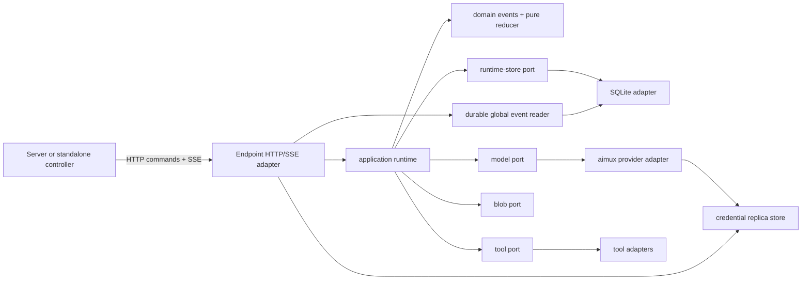

# zode Endpoint v0 runtime design

Status: authoritative design for the device-side Endpoint runtime. System
ownership and deployment are defined in `docs/architecture.md`; Server and UI
behavior are defined in `docs/server-api.md` and `docs/ui.md`. Production code
may lag this document while E2Es are being made red. A behavior change updates
the owning document before implementation. Referenced designs still require
the approval gate in the root `AGENTS.md`.

## 1. Purpose and scope

zode Endpoint is a headless, durable agent runtime exposed as an HTTP service.
It executes sessions on one device and owns session state, model turns, local
provider calls, tool execution, asynchronous completion, waiting, recovery,
and ordered event delivery.

The first version deliberately has one small product surface:

- commands and queries over HTTP;
- durable server-to-client events over SSE;
- append-only session history with SQLite as the default adapter;
- all model calls through aimux;
- synchronous, process-local asynchronous, and external-callback tools;
- local provider execution through aimux using installed credential replicas;
- authenticated, versioned credential-replica provisioning initiated by a
  controller;
- replaceable storage, model, tool, timer, blob, and credential adapters.

It does not include users, web UI, endpoint discovery/registration, provider
defaults, OAuth login, auth-profile management authority, cross-device routing,
a TUI, a general workflow engine, plugins, MCP hosting, multi-agent
orchestration, a sandbox platform, or a distributed cluster. Endpoint never
actively connects or registers with management Server. A WebSocket adapter is
deferred until a concrete controller-initiated bidirectional use case cannot be
served by HTTP commands plus SSE.

The user-approved runtime review for this version adopts Cue's durable
session ownership, delivery, async-tool, wait, and session-isolation behavior;
Dimi's bounded model-step retry and provider/async lifecycle scenarios; and
pi-ai/Dimi's provider-specific execution construction behind aimux. Endpoint's
model-round boundary and semantic crash checkpoints are defined directly by
this document. Endpoint deliberately changes Dimi's 1800-second wait maximum to
600, uses the earliest automatic wait deadline, supports multiple auth profiles
per provider type through installed replicas, and promotes every reviewed
behavior to real-process HTTP/SSE E2Es. Source code, internal test harnesses,
TUI/CLI surfaces, and Codex tests are not copied.

## 2. Vocabulary

- **Session**: the durable isolation and ordering boundary for one agent.
- **Command**: an idempotent request to change a session or control-plane
  resource.
- **Event**: an immutable semantic fact committed to a session stream.
- **Projection**: current state obtained by reducing events in stream order.
- **Delivery**: durable queued input for a session, such as user input, async
  completion, callback, or timer expiry.
- **Activation**: one exclusive period in which a session drains eligible
  deliveries and runs one or more model/tool rounds.
- **Round**: one model response followed by any tool batch it requested.
- **Async tool call**: a tool invocation that crossed the foreground window and
  continues independently after an early `async_running` result.
- **Wait**: one durable reason and deadline that ends an activation until a
  wakeable delivery or matching timer starts another activation.
- **Provider type**: a model protocol/implementation, not a login.
- **Auth profile**: one concrete OAuth login or API key for a provider type.
- **Auth replica**: one versioned credential copy installed on Endpoint by its
  authority for direct provider execution.

## 3. Architecture and dependency direction

The domain imports nothing from the other layers. The runtime depends on the
domain and declares effect ports. SQLite, aimux/provider, tools, credential
replicas, blobs, timers, and HTTP/SSE are adapters. `main.rs` only constructs
Endpoint adapters, runs recovery, starts schedulers, and serves HTTP.

Critical session mutations use one runtime-store port. Do not split event
append, delivery admission, wait/timer intent, async terminal result, runnable
projection, and publication facts across independently committing stores.
Credential-replica provisioning state is separate because it is not session
history and has different secrecy requirements. OAuth/profile authority is not
an Endpoint component.

## 4. Durable session model

Each session projection contains at least:

- stable session identity and selected provider/model/profile reference;
- stream version and command/delivery dedupe facts;
- transcript messages and assistant tool calls;
- bounded, versioned opaque model-continuation envelopes needed to resume the
  selected native provider protocol;
- ordered delivery queue plus materialization position;
- execution state: idle or one active activation;
- at most one active wait;
- async tool records keyed only by the model `tool_call_id`;
- bounded model-step retry, timeout-loop, and recovery facts required to
  explain the committed lifecycle.

The reducer is pure. Events carry IDs, times, deadlines, reasons, retry
decisions, and terminal outcomes generated outside the reducer. Provider wire
objects, SQLite rows, process handles, futures, subscribers, clocks, raw
credentials, and unbounded tool output cannot appear in the projection.

Native thought signatures or continuation tokens that must survive the next
round use a model-neutral durable envelope containing provider type, codec
version, semantic kind, and bounded opaque bytes. The domain never parses
those bytes. Arbitrary provider response metadata, raw stream frames,
authorization data, and headers are not accepted into that envelope.

Representative semantic events include:

- `SessionCreated`, `DeliveryQueued`, `DeliveryMaterialized`;
- `ActivationStarted`, `ModelRoundStarted`, `ModelRequestPrepared`,
  `ModelAttemptStarted`, `ModelAttemptFailed`, `ModelAttemptInterrupted`,
  `ModelStepRetryScheduled`, `ModelRequestCompleted`,
  `AssistantMessageCommitted`, `ActivationFinished`;
- `AsyncToolCallStarted`, `AsyncToolCallCompleted`,
  `AsyncToolCallFailed`, `AsyncToolCallCancelled`;
- `WaitSet`, `WaitCleared`, `WaitExpired`;
- an explicit ignored/no-change fact when a unique stale command must retain
  its idempotency binding without creating another terminal outcome.

Event names may evolve, but generic JSON patch events are forbidden.

## 5. Commands, idempotency, and transaction boundary

Every mutating HTTP command has:

- an authenticated controller authority and opaque subject scope;
- a stable command scope;
- an `Idempotency-Key` command ID;
- a versioned canonical fingerprint of its semantic request;
- a target stream and expected stream version where applicable.

The fingerprint covers a versioned command kind, path identities, and a
canonical semantic body. Canonical JSON recursively sorts object keys,
preserves array order, normalizes equivalent number/string representations as
defined by that command schema, and excludes whitespace or transport-only
headers. Canonical request bytes exist only transiently at admission. The
stored fingerprint is an algorithm/key-version tag plus a one-way digest; a
secret-bearing replica command uses HMAC with an Endpoint-owned,
restart-stable key so a low-entropy credential cannot be recovered by guessing.
Raw canonical bodies and secrets never enter command receipts, events,
operation journals, or result metadata. Repair reuses the original stored
digest and never recreates it from events.

Collection-level session creation uses one scope per controller
authority/subject. Endpoint generates the session ULID before append; clients
cannot supply it. A key reused with the same create fingerprint replays the
original ULID and outcome. A key reused with a different create body returns
`409` and performs no work.

### Session admission, ownership, and create receipts

Session admission has one authoritative order; HTTP handlers and storage
adapters must not each invent a partial version of it:

1. authenticate the controller and obtain its stable authority plus bounded
   opaque subject;
2. decode a versioned request and compute the command digest and canonical
   semantic fingerprint before any ULID, clock value, replica lookup, or other
   effect is allocated;
3. query the authority/subject-scoped collection receipt projection;
4. return replay, conflict, or replay-only miss immediately when that lookup
   decides the command;
5. only for a normal receipt miss, validate the current tool, provider
   descriptor, outbound-policy, and required replica state;
6. generate the ULID and creation time, construct one `SessionCreated` event,
   and ask the runtime store to atomically recheck the receipt and either
   commit that first event or return the winner of a concurrent create.

`SessionCreated` fixes the session ID, immutable owner authority/subject,
creation time, and initial credential-free selection. The raw idempotency key
and raw canonical request are not event fields. The event envelope carries a
versioned, domain-separated digest of `(authority, subject, create command,
Idempotency-Key)` and the pre-ULID request fingerprint. Consequently two
concurrent candidates for one logical create have the same fingerprint even
when they generated different unused ULIDs.

The collection receipt index is a projection, not another authority table. It
maps the scoped command digest to the verified version-1 creation event and can
be rebuilt from event-envelope and `SessionCreated` facts. A rebuild that maps
one scoped digest to multiple streams is corruption and fails closed. The
canonical `201` status/body is reconstructed from fixed protocol fields,
session ID, and stream version through the same response encoder used for the
first response; no serialized HTTP body is stored as a second fact. If a future
response needs a random or time-dependent field, that field must first become
a creation-event fact.

The application-facing storage seam is behavior-oriented rather than generic
CRUD. Conceptually it provides:

- `lookup_session_create(scope, command_digest, request_fingerprint)` returning
  miss, replay, or conflict without allocating or consulting current policy;
- `commit_session_create(...)` atomically returning created, replay, conflict,
  or local ULID collision;
- owner-scoped list, rehydrate, append, and event-read operations sharing one
  verified owner gate.

The owner/list projection records durable creation position and current stream
head. Pagination uses `(creation_global_position, session_id)` keyset order and
an opaque versioned cursor bound to route and owner scope; it never sorts by
ULID or keeps process-local page state. Public missing and cross-owner
read/message/SSE paths map to the same safe not-found result. Internal runtime
workers may address a known claimed session directly, but the HTTP adapter has
no unscoped session lookup escape hatch.

The session-admission decisions above are frozen through these exact
real-process Endpoint E2E anchors. Core rows guide the first usable session
path. A `required red` hardening or follow-up row blocks its corresponding
production change and final acceptance, but does not hold the core path behind
an unrelated corruption or migration fixture.

| Decision | Executable anchor | Delivery gate |
| --- | --- | --- |
| Controller authority and bounded subject are established before any scoped lookup | `e2e_invalid_controller_auth_and_subject_fail_before_lookup` | core anchor exists |
| Endpoint alone allocates the ULID; canonical create identity is independent of candidate ULIDs; caller IDs fail without side effects | `e2e_create_generates_ulid_and_binds_idempotency_payload` and `e2e_caller_supplied_session_id_has_no_list_side_effect` | core anchors exist |
| Receipt hit/conflict/replay-only miss returns before current provider, tool, outbound-policy, replica, clock, ULID, or event effects | `e2e_create_receipt_lookup_precedes_current_admission` | functional follow-up; required red before this ordering is implemented |
| Concurrent equal creates atomically select one creation event and return byte-identical canonical `201` results | `e2e_concurrent_create_receipt_and_event_are_atomic` | core anchor exists |
| The create-receipt projection rebuilds from the verified creation event and exact replay survives restart | `e2e_create_receipt_projection_rebuilds_from_verified_creation_event` | recovery hardening; required red before repair implementation |
| One scoped create digest resolving to multiple verified streams is corruption and never chooses a winner | `e2e_conflicting_create_receipt_projection_fails_closed` | corruption hardening; required red before repair implementation |
| Subject ownership under one authority covers list/read/message/SSE with existence-safe failures and independently scoped create keys | `e2e_session_ownership_safe_not_found_and_ordered_sse` and `e2e_session_list_is_subject_scoped` | core anchors exist |
| Authority ownership with the same opaque subject independently scopes create receipts and blocks cross-authority list/read/message/SSE | `e2e_authority_subject_create_receipts_are_scoped` plus `e2e_session_authority_ownership_isolates_list_read_message_and_sse` | receipt anchor exists; access-hardening anchor required red |
| List uses owner-bound opaque keyset pagination by durable creation position and resumes identically after restart | `e2e_session_list_keyset_is_owner_bound_and_restart_stable` | functional follow-up; required red before pagination implementation |
| History without the supported immutable owner fact cannot be claimed, repaired, or migrated to a guessed owner | `e2e_ownerless_session_history_fails_closed` | migration hardening; required red before migration handling |

An eventful command commits one non-empty event batch atomically. A unique
no-change command may commit an explicit ignored fact when retaining its
idempotency binding is externally relevant. Duplicate retries never append a
second fact.

One successful runtime-store transaction may atomically include:

- command receipt and canonical fingerprint;
- ordered session events and global positions;
- queued/materialized deliveries;
- wait replacement and durable timer intent;
- async terminal status, bounded inline result or blob reference;
- runnable/timer/stream-head projections;
- state and event-prefix integrity anchors.

Publication happens only after commit. A failed transaction exposes none of
these changes.

## 6. Append-only storage, projections, and snapshots

The session event stream is the only reconstructable source of session state.
Command receipts and integrity anchors are append-only supporting facts;
snapshots and mutable indexes never replace the stream.

The default SQLite adapter uses WAL, a busy timeout, short write transactions,
and blocking workers outside Tokio's async executors. Events carry stable
stream versions and globally increasing public positions.

Mutable projections may include stream heads, command lookup, runnable
sessions, and due timers. Normal append updates them in the same transaction as
events. SQLite stores explicit projection schema/health metadata and marks a
projection dirty when its authoritative inputs or projection rows are changed.
A healthy startup performs only read-only bounded metadata checks and does not
acquire a writer lock or scan history. A dirty, missing, or incompatible
projection is repaired from append-only facts and marked clean only in the
repair transaction.

Event metadata retains the original versioned command fingerprint, so repair
never recreates idempotency identity by serializing historical events with new
code.

### Snapshot integrity and bounded replay

At each eligible committed batch head, append stores:

- an incremental event-prefix digest;
- a reducer/state schema version;
- a digest of the canonical resulting session state.

These integrity anchors are independent of the snapshot row. A snapshot stores
the canonical state payload, stream version, schema versions, payload checksum,
and referenced prefix/state digests. Snapshot write verifies them against the
append-only anchor for that version.

Rehydration uses one consistent storage read view:

1. read the stream head and compatible snapshot candidates;
2. choose the newest candidate whose identity, schema, payload checksum,
   independently anchored state digest, and prefix digest match;
3. read and reduce only events after that snapshot;
4. verify final version and final state/prefix anchors;
5. if a candidate is invalid, try an older one, then full replay.

It must not read or replay the snapshotted prefix during a healthy restore.
Snapshot creation is asynchronous after event commit; failure leaves history
valid. Snapshot thresholds are based on replay cost such as event count and
bytes, never wall time alone. Snapshots neither consume public event positions
nor appear as domain SSE events.

Large tool output is written to immutable blob storage before the referencing
event commits. A failed event commit may leave an unreferenced blob for garbage
collection; an event must never reference a blob that was not durably written.

## 7. Activation lifecycle

Only one activation may own a session at a time. Different sessions can run in
parallel. A durable runnable projection and an atomic claim prevent two runtime
workers from activating the same session.

Activation proceeds as follows:

1. in one expected-version transaction, claim one runnable session, commit
   `ActivationStarted` with the concrete provider/model/profile selection and
   selection version plus the required minimum auth-replica revision captured
   for that activation, materialize every delivery eligible at the claim
   boundary in durable order, and clear or supersede the matching wait;
2. treat that claim as the first model-round boundary; before every later model
   round in the same activation, atomically materialize all deliveries
   committed since the previous boundary in durable order and commit the new
   round boundary;
3. construct each model request only from the projection committed at its
   round boundary;
4. run model/tool rounds until the assistant finishes, a wait ends the
   activation, an error is committed, or a configured safety budget is reached;
5. commit the terminal activation fact and make any queued wakeable deliveries
   runnable for a later activation.

Input, async completion, callback, or timer arriving during a model request is
queued immediately but cannot alter the HTTP request already sent. If the
activation reaches another model round, the delivery is materialized at that
next round boundary and steers its request. If the activation finishes or
waits first, the delivery wakes a later activation. Tool results created by the
current round are part of that activation and are supplied to its next model
round. The event log records the boundary that actually consumed each delivery;
zode does not claim that different real-world arrival timing must produce the
same model prompt or output.

A model-selection command committed during an activation changes the session's
next selection immediately but never retargets that activation. Every round in
the active activation uses its captured selection. The next activation captures
the latest committed selection; recovery can therefore prove which provider,
model, and auth profile owned every activation. Each model attempt separately
records the installed credential revision resolved immediately before its
request, so rotation can affect a later request without retargeting one already
sent. Secret bytes remain outside the event stream.

An HTTP or SSE disconnect does not cancel an activation. Runtime shutdown stops
accepting new claims, gives bounded time to commit safe outcomes, and relies on
startup reconciliation for anything left active.

## 8. Model and tool rounds

All model requests use aimux streaming. The provider adapter preserves text,
reasoning, incremental tool input, completed tool calls, usage and response
metadata, finish reasons, thought signatures, and provider continuation
metadata. Invalid transcript/tool conversion is an explicit error; content or
schemas are never silently dropped.

Aimux's bounded transport retry remains enabled. It handles connection errors,
rate limits, and retryable provider responses before a successful stream is
established. Those wire attempts are adapter observability, emitted through
secret-safe tracing/metrics, and are not session-domain events. A session
records one logical model request around the aimux call.

Before calling aimux, zode commits `ModelRequestPrepared` with stable
activation/round/request IDs, captured provider execution descriptor revision
and fingerprint, model/profile selection, maximum zode attempt count, minimum
auth-replica revision, prompt and tool-schema
fingerprints, and a reference to the complete bounded, credential-free
model-neutral request envelope from which the aimux adapter constructs its
call. Large envelopes use the immutable blob store. The logical request is
prepared once. Immediately before each call to aimux, zode resolves the exact
ready credential replica and commits `ModelAttemptStarted` with a fresh attempt
ID, monotonic attempt number, and concrete auth revision. Authorization headers
and credential material are never part of the envelope or event.

Credential resolution reads only the exact installed profile selected for the
session and the newest ready revision satisfying its required minimum. It never
uses an Endpoint default, ambient environment fallback, another profile, or a
stale tombstoned revision. A credential revision replaced during an already
sent request affects only a later request.

If aimux ultimately returns a retryable error, including an error after the
stream began, zode may retry the same model step under a configured bounded
attempt budget. It commits `ModelAttemptFailed` and
`ModelStepRetryScheduled` with the classified error, delay, and next attempt
number. Every attempt in that retry group references the same prepared request
fingerprint; deliveries arriving during the group wait for
the next actual model-round boundary. Aimux `Retry-After` hints and bounded
jittered backoff are honored. Auth, invalid request/model, schema conversion,
and other non-retryable failures end the activation without retry.

Text, reasoning, tool-input fragments, and usage from an incomplete attempt are
transient candidates. A model attempt succeeds only after the complete stream
ends normally with a valid finish and all tool calls validate. Only then may
zode atomically commit the assistant outcome and tool-call batch. It never
dispatches a tool from `ToolInputStart`/`ToolInputDelta` or from a completed
`ToolCall` followed by a failed stream. Retrying can produce different model
output; the runtime promises durable causality and bounded effects, not model
determinism.

Only continuation fields required for a later native request are normalized
into the bounded durable envelope. Debug/raw stream parts remain transient and
secret-safe; they are neither durable session state nor public events.

For one assistant tool-call batch:

1. validate every call and durably commit the assistant message, tool calls,
   stable invocation keys, and invocation intent before starting any side
   effect;
2. start all ordinary calls concurrently only after that commit;
3. give the entire batch one shared foreground window, initially three
   seconds;
4. collect calls finished inside the window and mark remaining calls
   `async_running`;
5. commit ordinary tool results in original provider order, independent of
   completion order;
6. continue the activation when everything is complete, or establish one wait
   when asynchronous work remains.

The original `tool_call_id` is the only identity across ordinary result, async
record, wait membership, callback, status lookup, cancellation, and recovery.
A background completion is a runtime notification, not a second ordinary tool
result.

An automatic wait covers all relevant async-running calls. Its timeout is the
minimum declared `auto_wait_timeout_seconds` among them; provider order breaks
ties. Normal tools default to 20 seconds and user-interaction tools may declare
120 seconds.

If the same model batch contains `wait_for`, ordinary calls still execute. The
explicit wait is the final wait intent and replaces automatic wait. If there
are multiple explicit waits, the last in provider order wins.

## 9. Wait and async completion

`wait_for` has required `reason` and optional `timeout_seconds`. It defaults to
60 seconds and accepts 1 through 600 seconds. It returns an ordinary tool result,
commits `WaitSet` with timer intent, and ends the activation.

A session has at most one active wait. A later wait replaces it. Timer delivery
contains its `wait_id`; it expires the wait only if that ID is still current.
Commit order resolves races: a wakeable delivery committed before the timer
marks a wake pending, so the timer is stale even if activation has not yet
materialized that delivery and emitted `WaitCleared`. Timeout wakes the session
but never cancels a running tool. A separate tool watchdog controls execution
timeout.

Async completion atomically commits the first terminal outcome, bounded result
or blob reference, and exactly one wakeable delivery. Completion, failure,
cancellation, and callback race under first-terminal-wins semantics. Later
terminal attempts neither overwrite the result nor wake again.

`planned` means invocation intent is durable but no dispatcher has claimed it.
A dispatcher must durably move it to `running` before beginning any side
effect. Recovery may therefore dispatch an unclaimed plan once. A process-bound
running tool cannot have survived restart and becomes `runtime_restarted`. A
remote response tool whose request may have executed becomes
`unknown_outcome`. An authenticated external-callback call may remain running
and complete after restart. Each tool declares these recovery semantics; the
runtime rejects an adapter/configuration combination that cannot uphold them.
Stable invocation keys, provider idempotency, fencing, and explicit
unknown-outcome states handle external side effects; the event store alone
cannot promise exactly-once effects.

`unknown_outcome` is a durable nonterminal reconciliation state, not a fake
failure and not permission to repeat a side effect. It is used when dispatch
may have executed but neither acknowledgement nor a terminal callback is
known. An authenticated callback may still resolve it to completed or failed.
An explicit reconciliation command may retry only when the tool contract
guarantees deduplication/fencing for the same invocation key. It retains the
original `tool_call_id`. V0 exposes no manual `mark_failed`: accepting an
operator assertion without an adapter-verifiable evidence protocol would turn
uncertainty into a false fact. A tool without callback or safe retry may remain
unknown until a future evidence-bearing reconciliation adapter is configured.
Ordinary cancellation is rejected while outcome is unknown because
`cancelled` would falsely claim that the side effect did not happen.

External-callback dispatch uses a durable outbox/intention committed with the
invocation facts, including one stable non-secret opaque callback ID. Its
separate bearer is reproducible from an Endpoint callback secret plus that ID,
or stored in a replaceable Endpoint secret store; raw bearer bytes never enter
events or URLs. Recovery can therefore retry an unacknowledged dispatch with
the same invocation key and callback identity. The external tool must
deduplicate that invocation key.

## 10. Provider execution and credential replicas

A provider type on Endpoint owns model discovery, native execution protocol,
stream conversion, error classification, and aimux construction. Native aimux
providers keep their native wire protocol. OpenAI-compatible is an explicit
provider configuration, not a common intermediate representation for native
providers.

Endpoint ships provider adapter kinds, not one user-configured provider account
per device. A concrete session selection carries a bounded, versioned,
credential-free execution descriptor supplied by its controller: provider type,
base URL when configurable, model/catalog identity, and adapter options.
Endpoint validates the descriptor against its local outbound policy and stores
it as non-secret session selection state. This lets Server configure once while
provider protocol logic remains entirely on Endpoint.

Endpoint does not own Server provider defaults, OAuth attempts, labels/account
hints as management authority, refresh policy, or sharing policy. A controller
provisions a concrete auth profile as a versioned credential replica using the
protocol in `docs/auth-replication.md`.

A Server-managed replica is identified by authority ID, profile ID, provider
type, credential schema, and monotonic revision. Endpoint may persist it in a
restrictive encrypted or `0600` secret store so direct provider calls survive
restart. The non-secret replica journal stores only identity, phase, expiry,
status, and a versioned keyed fingerprint. Secret bytes never enter the session
event store, snapshots, blobs, logs, or public event stream.

Replica installation uses staged secret write, append-only non-secret operation
journal, atomic promotion, and ready acknowledgement. Startup reconciles every
pending install and tombstone before reporting capabilities. A lower revision
cannot overwrite or resurrect a higher revision. The same revision with a
different fingerprint conflicts. A tombstone prevents new resolution before
secret cleanup and is itself monotonic.

### Replica state and application boundary

Credential provisioning and session history never share a transaction or
store. The replica adapter owns a per-`(authority_id, auth_profile_id)` monotonic
state machine with these durable facts:

- immutable, non-secret install/tombstone intent and keyed request fingerprint;
- one protected staged or active secret reference for an install revision;
- a promotion manifest identifying the current ready revision or tombstone;
- a bounded, non-secret exact operation receipt.

The raw secret exists only in the protected replica adapter. Promotion of the
active manifest is the resolution linearization point. Before it, the previous
ready revision remains resolvable; after it, new resolution sees the promoted
revision or tombstone even if receipt persistence or cleanup later fails. A
tombstone carries no secret and makes resolution unavailable before deleting
old bytes. Startup reconciles intents, manifests, receipts, and staged files
before HTTP readiness. Historical operation receipts are direct lookup facts;
the recovery tail stays bounded and startup does not replay all provisioning
history.

Replica command idempotency is controller-authority and profile-resource
scoped, not session-owner scoped. The authenticated controller authority must
match the profile authority in the command. The opaque session subject is not
an auth-profile owner: profiles are authority-managed resources that may be
shared by many subjects. The same operation key/fingerprint replays its safe
response, while a changed fingerprint conflicts without exposing whether
secret bytes matched.

The runtime sees two narrow ports:

- a provisioning port used only by authenticated Endpoint control commands;
- a resolver accepting exact authority/profile/provider/schema identity and a
  minimum revision, returning non-secret metadata plus a short-lived secret
  lease for one provider attempt.

A secret lease is neither serializable nor cloneable into session state. It is
resolved after `ModelRequestPrepared` and immediately before the corresponding
aimux call; only its concrete revision enters `ModelAttemptStarted`. Session
creation may check that an eligible replica currently exists, but stores only
the selected identity and minimum revision. Replay-only create returns its
event-derived receipt before that current replica check, and a later model
attempt resolves again rather than retaining admission-time credential bytes.

A session selects an explicit provider execution descriptor and revision,
model, authority/profile identity, and minimum replica revision. Endpoint does
not resolve a management default or randomly choose another profile. At each
model attempt it captures the concrete ready replica revision. Deletion or
replacement does not alter an already-sent request; later requests resolve the
newest eligible ready revision or commit a typed safe auth-replica failure.
There is no environment fallback, profile rotation, or provider failover.

For Server-managed profiles in v0, Server is the sole refresh authority.
Endpoint consumes new revisions but does not refresh or write a competing
revision. Endpoint-local profiles are allowed for standalone controllers under
a distinct authority identity; they cannot collide or merge with a
Server-managed profile.

## 11. Public HTTP and SSE contract

The initial versioned resources are:

- create/read sessions, append messages, and select the model/profile;
- `GET /v1/sessions/{session_id}/events` using SSE and `Last-Event-ID`;
- read/cancel/reconcile async tool calls and accept authenticated external
  completion;
- read Endpoint identity, health, and provider/tool capabilities;
- install, inspect, and tombstone versioned credential replicas through the
  authenticated controller API.

User-facing provider/profile/default/OAuth resources belong to management
Server and are defined in `docs/server-api.md`, not mounted on Endpoint.

Exact request and public event schemas are versioned in the API adapter as they
are introduced. Mutations return only after durable commit/admission, not after
an entire agent run.

SSE IDs are durable global event positions. A publisher serializes cursor
advancement and backfills all committed positions from storage, so handler
completion order cannot reorder or lose events. A subscriber subscribes before
replay, deduplicates by cursor, and recovers lag from storage. Durable lifecycle
and final-message events reconnect; token deltas may remain transient.

Public failures use a stable envelope such as
`{"error":{"code":"internal_error","message":"internal server error","retryable":false}}`.
Malformed transport input, missing resources, semantic validation,
idempotency/OCC conflict, authentication, and internal failures have distinct
status/code classes. Storage, reducer, provider, tool, credential, and debug
messages are logged only through secret-safe structured fields and never copied
into HTTP or SSE error text.

## 12. Recovery and replacement guarantees

On startup zode:

1. acquires one exclusive process-lifetime lock bound to the configured stable
   Endpoint/runtime/credential identity, or fails readiness without opening
   a second runtime authority;
2. opens storage without rewriting a healthy database;
3. repairs only dirty/missing operational projections;
4. reconciles model-step state with an expected-version CAS: a scheduled retry
   already contains its stable next attempt ID/number and is claimed exactly
   once; an unterminated started attempt commits `ModelAttemptInterrupted` and
   either schedules one stable next attempt while budget remains, or atomically
   commits typed `model_attempts_exhausted`, `ActivationFinished`, and runnable
   status for queued deliveries when exhausted. An assistant/tool outcome
   already committed before the crash is never rerun;
5. reconciles staged credential-replica installs, tombstones, active secret
   files, and non-secret replica metadata before reporting capabilities;
6. reconciles running/planned tool work according to its durable recovery
   policy;
7. preserves external-callback calls and durable waits/timers;
8. queues runnable sessions and starts HTTP only after recovery metadata is
   consistent.

Replacing SQLite, blob, credential, timer, provider, or tool adapters cannot
change public HTTP/SSE semantics. Every replacement must pass the same
backend-neutral HTTP/SSE E2E suite. Storage adapters must provide consistent
reads and the transaction boundary described above, not merely individual CRUD
methods. Adapter-specific corruption and catalog checks remain in a separate
profile and never narrow the shared public contract.

The canonical backend-neutral entry is
`scripts/ci/storage-conformance.sh`. It runs the real-process
`tests/http_sse_e2e.rs` suite without importing the Endpoint library or calling
storage handlers directly. The default profile is `ZODE_CONFORMANCE_BACKEND=sqlite`
and uses the repository's `zode` binary. A future storage adapter supplies its
own compatible real Endpoint binary through `ZODE_CONFORMANCE_ENDPOINT_BIN` and
selects a stable profile label; the shared suite covers HTTP/SSE commands,
ordered reconnect, restart, idempotency, ownership, and durable event
semantics. SQLite-only snapshot corruption, cursor, and catalog/index repair
checks run from `tests/sqlite_storage_e2e.rs` only for the sqlite profile. The
script writes only a non-secret run manifest under `target/ci` and fails if the
selected binary is missing or not executable.

## 13. E2E specification and implementation workflow

The E2E suite is the executable product specification. It always starts the
real Endpoint binary, uses public Endpoint HTTP/SSE, a real temporary backend
store (SQLite for the default profile), and network fake providers/tools
reached through production adapters.
There are no unit, doctest, in-process handler, direct-domain, or hidden-route
tests. Server, all-in-one, credential-distribution, and browser E2Es are owned
by the suites described in `docs/architecture.md`; they reuse this Endpoint
binary rather than introducing an in-process fake.

The table below is only a behavior index; prose rows alone do not satisfy the
contract. The exact `e2e_*` names are the implementation anchors. A listed
behavior with no existing named case blocks implementation of that behavior,
not unrelated work on the normal vertical slice. The E2E owner adds and
demonstrates the red scenario before the corresponding production change. If
one anchor covers multiple decisions, its assertions must prove each one
independently.

The main scenario groups are:

| Area | Required public scenario | Current executable anchors |
| --- | --- | --- |
| HTTP/event store | create, message, semantic idempotency, GET/list ownership, ordered SSE reconnect, restart | `e2e_create_message_sse_reconnect_get_restart`; `e2e_create_generates_ulid_and_binds_idempotency_payload`; `e2e_concurrent_create_receipt_and_event_are_atomic`; `e2e_session_ownership_safe_not_found_and_ordered_sse` |
| Snapshot/recovery | bounded snapshot-plus-tail restore, every configured runtime/API snapshot cadence point, corrupt fallback, dirty-index repair, healthy read-only startup | `sqlite_storage_e2e::e2e_sqlite_snapshot_cursor_follows_public_commits`; `sqlite_storage_e2e::e2e_snapshot_cannot_override_event_stream`; `sqlite_storage_e2e::e2e_corrupt_latest_snapshot_falls_back`; `e2e_runtime_commits_honor_snapshot_cadence_and_restart`; `sqlite_storage_e2e::e2e_sqlite_restart_rebuilds_derived_indexes_and_allows_harmless_extra_index`; storage-corruption cases in `reviewer_findings_e2e` |
| Model activation | real aimux fake provider, final assistant event, input/completion arriving mid-request steers the next round when one exists, otherwise wakes the next activation; active model change remains deferred to the next activation; configured round budget stops feedback loops while allowing a queued user to wake a fresh activation; every accepted input and assistant round remains durably ordered online and after restart without a new client command | `e2e_golden_assembled_model_tool_loop_survives_restart`; `e2e_round_boundary_steering_waits_for_the_next_model_round`; `e2e_round_boundary_final_defers_steering_to_next_activation`; `e2e_max_rounds_per_activation_stops_tool_feedback_loop`; `e2e_concurrent_inputs_preserve_both_assistant_rounds`; `e2e_restart_recovers_queued_input_without_another_command` |
| Model retry | aimux bounded pre-stream retry remains one logical runtime request; after stream establishment zode owns bounded step retry; no partial assistant/tool effect; hard-crash interrupted-attempt recovery | `e2e_model_pre_stream_rate_limit_is_one_logical_request`; `e2e_model_partial_stream_retry_has_no_partial_tool_effect`; `e2e_hard_crash_recovery_exhausts_one_model_attempt_and_keeps_delivery_runnable`; `e2e_hard_crash_after_retry_fact_claims_one_scheduled_attempt` |
| Tool batch | schema-valid model arguments, invalid arguments fail before side effects, fast/slow/failing concurrent calls, provider-order results, one shared foreground window | `e2e_invalid_model_tool_arguments_are_rejected_before_side_effect`; `e2e_mixed_tool_batch_is_concurrent_ordered_and_waits_once` |
| Async/wait | early result, auto wait, explicit-wait precedence, user/timer race, completion wake, timeout without cancel, maximum 600 seconds | `e2e_explicit_wait_last_wins_without_skipping_ordinary_tool`; `e2e_explicit_wait_zero_is_rejected`; `e2e_explicit_wait_above_maximum_is_rejected`; `e2e_explicit_wait_legacy_high_value_is_rejected`; `e2e_auto_wait_timeout_does_not_cancel_running_tool`; `e2e_two_session_waits_do_not_cross` |
| Terminal races | cancel/complete/callback first-wins, duplicate semantic callback, unknown-outcome cancel/unsupported mark-failed rejected, no second wake/event | `e2e_external_completion_first_wins_and_wakes_one_next_activation`; `e2e_restart_remote_response_becomes_unknown_and_cancel_cannot_rewrite_it`; `e2e_restart_unknown_response_rejects_unsupported_mark_failed` |
| Restart | unclaimed plan dispatches once; process-bound call fails without retry; external callback survives; ambiguous remote dispatch becomes reconcilable `unknown_outcome` | `e2e_http_response_tool_rejects_runtime_restarted_recovery`; `e2e_external_callback_tool_stays_running_and_completes_after_restart`; the model hard-crash anchors above |
| Credential replicas | controller installs multiple explicit profiles, revision/tombstone races, historical operation replay with expiry metadata, restart recovery, exact selection, and no default/environment fallback; a tombstone produces a durable typed auth-unavailable terminal without provider traffic before and after restart | `e2e_auth_replica_revision_tombstone_and_restart_are_secret_free`; `e2e_tombstoned_replica_never_reaches_provider_before_or_after_restart`; `e2e_auth_replica_history_receipt_binds_original_revision`; `e2e_auth_replica_expiry_and_historical_receipt_survive_restart`; additional exact-selection and multi-profile cases must be red before their production paths |
| Provider execution | installed replica drives local aimux directly; descriptor schema is exact while its positive controller-assigned revision and bounded credential-free options round-trip unchanged across Server proxying and Endpoint restart; credential-bearing URLs have no side effects; rotation affects the next request while an in-flight request keeps its captured revision | `e2e_unknown_provider_execution_schema_is_rejected_and_revision_round_trips`; `e2e_credential_bearing_model_base_url_is_rejected_without_side_effects`; `e2e_server_forwards_and_endpoint_persists_provider_execution_options`; deterministic fake-provider roundtrip/retry cases; opt-in `e2e_live_opencode_provider_roundtrip_and_restart`; rotation still requires its named red case before implementation |
| Security/bounds | no secrets in HTTP/SSE/log/session DB; oversized output uses a blob reference | `e2e_public_500_redaction`; replica secret scanning in `e2e_auth_replica_revision_tombstone_and_restart_are_secret_free`; oversized-output/blob case must be red before that production path |

Development order is strict:

1. the main agent fixes this design and the major E2E contract;
2. an E2E owner demonstrates each intended behavior or discovered production
   bug as a failing real-process test;
3. the assigned implementation worker changes only the authoritative
   production path until it passes;
4. the same independent adversarial reviewer re-reviews the module;
5. every new behavioral finding returns to step 2 before any fix;
6. the main agent performs the final cross-module architecture, full E2E,
   static-gate, diff, and code-size review.

An implementation worker or reviewer may not weaken, skip, internally bypass,
or rewrite a red E2E to fit a fix. Build failures and purely static dependency
violations use compiler/lint/architecture gates; any issue observable through a
running product requires its own red E2E first.
